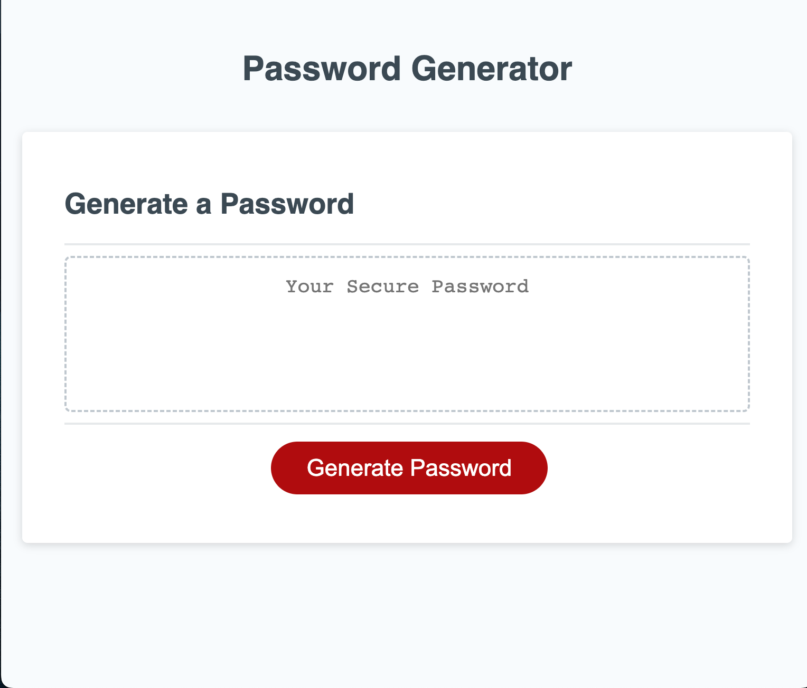

# Password-generator

## Description

In this challenge, I modified starter code to create an application that enables users to generate random passwords based on criteria that they’ve selected. This application runs in the browser and features dynamically updated HTML and CSS powered by JavaScript code. It will has a  responsive user interface that adapts to multiple screen sizes.

## Table of Contents

- [Installation](#installation)
- [Usage](#usage)
- [Credits](#credits)
- [Features](#features)

## Installation

This application was accomplished with technologies such as Javascript, HTML & CSS. No necessary installations needed, just click the deployed link below to utilize.

## Usage
User is able to to randomly generate a password that meets certain criteria.
Users can create a strong password that provides greater security.
When a user clicks the button to generate a password, the user is presented with a series of prompts for password criteria.
User is able to choose a length of at least 8 characters and no more than 128 characters.
User is able to confirm whether or not to include lowercase, uppercase, numeric, and/or special characters.
When user answers all prompts, a password is generated that matches the selected criteria.
Afterwards, the password is generated and the password is either displayed in an alert or written to the page.

Below, are screenshots of how my web application currently looks like:

## Credits

Class-activities.

## Features

- A password generator that prompts for password criteria.
- User inout for each prompt is validated.
- After all prompts are answered, password is generated for the user that matches selected criteria.
- Generated password is either displayed in alert or written to the page.

## Links
Code link: https://github.com/Awele1111/Password-generator

Demo link: https://awele1111.github.io/Password-generator/

